# Mini Hospital Emergency Management System

## CIT300 - Data Structures and Algorithms
### Individual Mid Assignment

---

## 1. Project Overview

The Mini Hospital Emergency Management System is a Java console-based application developed to demonstrate the practical implementation of fundamental data structures.

The system allows hospital staff to manage patient records, emergency patient queues, completed treatment history, and individual patient visit histories.

All main data structures in this project were implemented manually without using Java's built-in collection classes for the core operations.

---

## 2. Main Features

### Patient Management
- Register a new patient
- Search for a patient using Patient ID
- Delete a patient record
- Display all patients in ascending Patient ID order
- Prevent duplicate Patient IDs

### Emergency Queue Management
- Add registered patients to the emergency queue
- Treat the next patient in the queue
- Display all waiting patients
- Handle an empty emergency queue

### Treatment History Management
- Add completed treatment records
- Remove the latest treatment record
- Display completed treatment history
- Handle an empty treatment stack

### Patient Visit History
- Add previous patient visits
- Search for a visit using Visit ID
- Remove a patient visit
- Display all visits belonging to a patient

---

## 3. Data Structures Used

### Binary Search Tree (BST)

Patient records are stored in a Binary Search Tree using the Patient ID as the key.

Supported operations:
- Insert patient
- Search patient
- Delete patient
- In-order traversal

The in-order traversal displays patient records in ascending order according to Patient ID.

### Queue

A custom linked Queue is used to manage emergency patients.

The Queue follows **FIFO - First In, First Out**.

Supported operations:
- Enqueue
- Dequeue
- Display queue
- Empty queue handling

The first patient added to the emergency queue is the first patient selected for treatment.

### Stack

A custom linked Stack is used to store completed treatment records.

The Stack follows **LIFO - Last In, First Out**.

Supported operations:
- Push
- Pop
- Display stack
- Empty stack handling

The most recently added treatment record is the first record removed.

### Singly Linked List

Each patient has an individual Singly Linked List containing their previous hospital visits.

Each visit stores:
- Visit ID
- Visit Date
- Doctor Name
- Diagnosis
- Treatment

Supported operations:
- Add visit
- Search visit
- Remove visit
- Display visit history

---

## 4. Patient Information

Each patient record contains:
- Patient ID
- Name
- Age
- Contact Number
- Medical Condition

The Patient ID is used as the key in the Binary Search Tree.

---

## 5. Project Classes

The project contains the following Java classes:

- Main.java
- Patient.java
- PatientNode.java
- PatientBST.java
- QueueNode.java
- EmergencyQueue.java
- TreatmentRecord.java
- StackNode.java
- TreatmentStack.java
- Visit.java
- VisitNode.java
- VisitLinkedList.java

---

## 6. System Menu

[ PATIENT MANAGEMENT ]

1. Register New Patient
2. Search Patient
3. Delete Patient
4. Display All Patients

[ EMERGENCY QUEUE ]

5. Add Patient to Emergency Queue
6. Treat Next Emergency Patient
7. Display Waiting Patients

[ TREATMENT HISTORY ]

8. Add Completed Treatment
9. Remove Latest Treatment
10. Display Treatment History

[ PATIENT VISIT HISTORY ]

11. Add Patient Visit
12. Search Patient Visit
13. Remove Patient Visit
14. Display Patient Visit History

0. Exit

---

## 7. Input Validation

The application includes basic validation to improve reliability.

Examples include:
- Duplicate Patient IDs are rejected.
- Invalid main menu input is handled without terminating the application.
- Operations involving unregistered patients display an appropriate message.
- Empty Queue and Stack conditions are handled safely.

---

## 8. How to Run the Project

### Requirements

- Java JDK
- Eclipse IDE or another Java-compatible IDE

### Using Eclipse

1. Open Eclipse.
2. Import or open the project.
3. Open Main.java.
4. Right-click Main.java.
5. Select Run As > Java Application.
6. The application menu will appear in the Eclipse Console.
7. Enter the required menu option and follow the instructions shown by the program.

---

## 9. Program Output Screenshots

### Main Menu
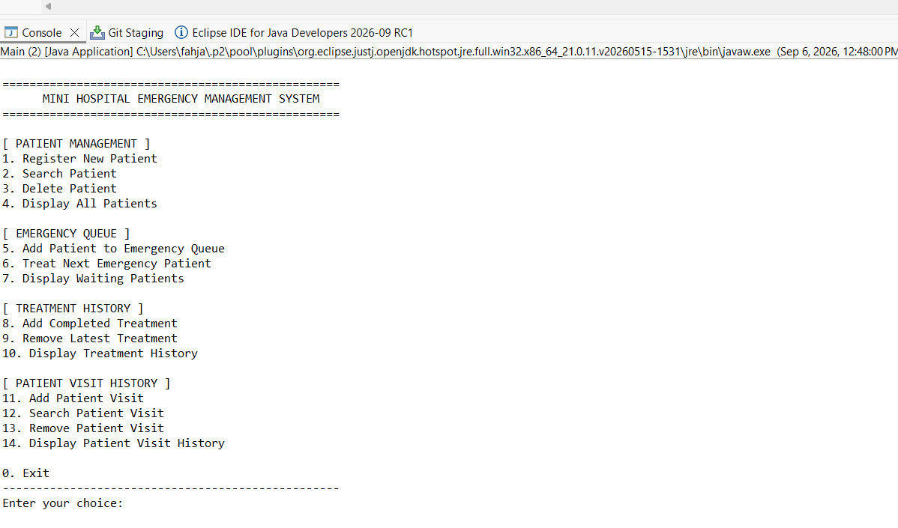

### BST - Patient Insertion
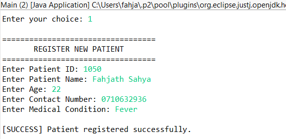

### BST - In-Order Traversal
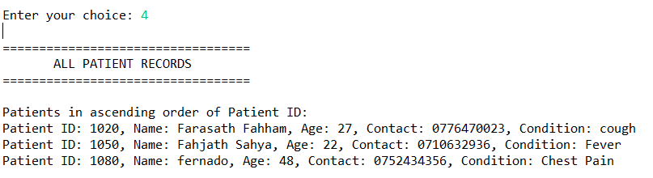

### BST - Patient Search
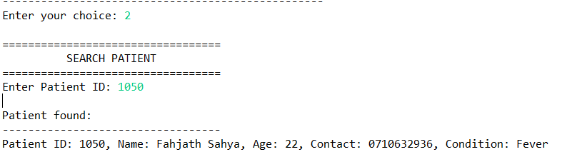

### BST - Patient Deletion
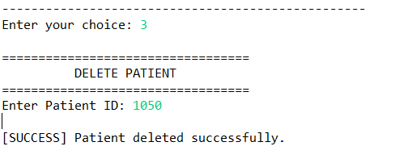

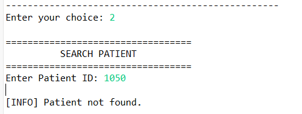

### Emergency Queue - Display
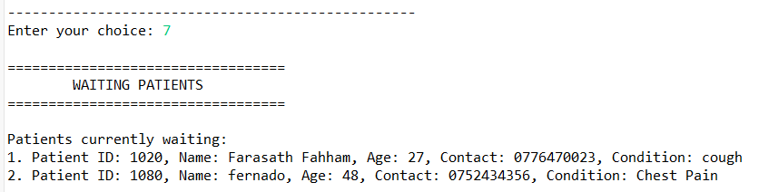

### Emergency Queue - Dequeue
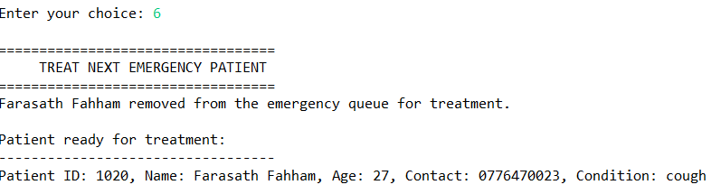

### Emergency Queue - Empty Handling
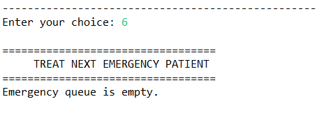

### Treatment Stack - Display
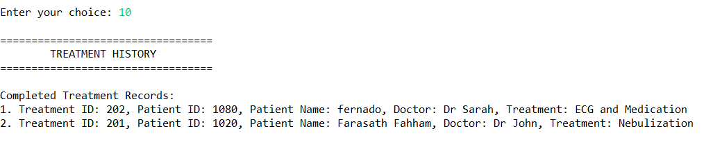

### Treatment Stack - Pop
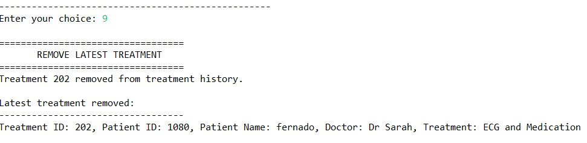

### Treatment Stack - Empty Handling
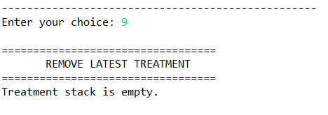

### Linked List - Visit History
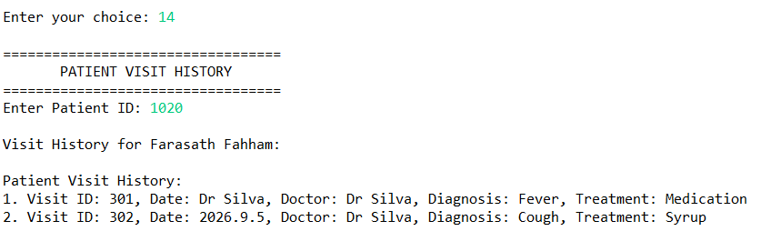

### Linked List - Search Visit
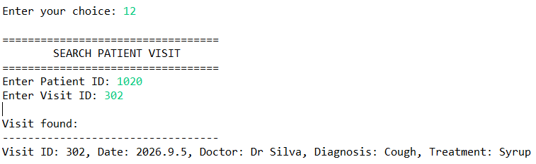

### Linked List - Remove Visit
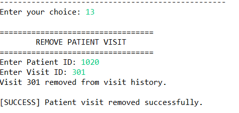

---

## 10. Testing

### BST Testing
- Inserted multiple patients
- Searched for existing patients
- Deleted patient records
- Verified deleted patients could no longer be found
- Verified ascending Patient ID order using in-order traversal

### Queue Testing
- Added multiple emergency patients
- Verified FIFO order
- Removed patients for treatment
- Tested empty queue handling

### Stack Testing
- Added multiple completed treatments
- Verified LIFO order
- Removed the latest treatment
- Tested empty stack handling

### Linked List Testing
- Added multiple visits to a patient
- Searched for specific visits
- Removed visits
- Displayed remaining visit records

---

## 11. Development and Version Control

Git and GitHub were used throughout the development of this project.

The repository contains progressive and meaningful commits representing the development of:
- Project structure
- Patient model
- Binary Search Tree
- Emergency Queue
- Treatment Stack
- Patient Visit Linked List
- Menu integration
- Input validation
- Testing
- Output screenshots
- Documentation

This commit history demonstrates the progressive development of the system rather than uploading the complete project as a single final commit.

---

## 12. Design Decisions

The project uses custom node-based data structures so that the internal working of each required data structure can be clearly demonstrated.

Patient records are stored in a Binary Search Tree because Patient ID can be used as the search key.

Emergency patients are stored in a Queue because emergency requests are processed according to FIFO order.

Completed treatments are stored in a Stack to demonstrate LIFO behaviour.

Each patient's previous visits are stored in a Singly Linked List because the number of visits can grow dynamically.

---

## 13. Conclusion

The Mini Hospital Emergency Management System demonstrates the practical use of four fundamental data structures in Java:

- Binary Search Tree
- Queue
- Stack
- Singly Linked List

The project integrates these structures into one console-based hospital management application while supporting patient registration, emergency management, treatment history, and previous visit management.